<!-- ====================================================================== -->
<!--                            HEADER / BANNER                             -->
<!-- ====================================================================== -->

<div align="center">



<a href="https://github.com/nikrich">
  
</a>

<br/>

<!-- South Africa GitHub ranking - the headline -->
<a href="https://github.com/gayanvoice/top-github-users/blob/main/markdown/public_contributions/south_africa.md">
  
</a>

<br/><br/>

<a href="https://www.linkedin.com/in/nikrich/"></a>
<a href="mailto:jannik811@gmail.com"></a>


<br/><br/>


<a href="https://github.com/nikrich?tab=followers"></a>


</div>

<!-- ====================================================================== -->
<!--                                ABOUT                                   -->
<!-- ====================================================================== -->

## whoami

```ts
const jannik: Engineer = {
  role:        "Software Architect @ Sanlam Fintech",
  location:    "Cape Town, South Africa",
  daytime:     "Distributed systems on Azure & AWS: DDD, event-driven, edge",
  nighttime:   "Unreal Engine 5 games + multi-agent AI orchestration",
  currently:   "Teaching AI agents to build games inside Unreal Engine",
  loves:       ["good architecture", "music", "food", "wine", "cats"],
  philosophy:  "Ship small, ship sharp, automate the boring parts.",
};
```

I'm a full-time **software architect** building distributed, event-driven systems, and a part-time **game developer** who's been at it since the XNA days, through Unity and Unreal Engine 3, and now living in **Unreal Engine 5**. Lately I'm obsessed with the intersection of the two: **autonomous AI agents that write code, orchestrate like Agile teams, and build games on their own.**

<!-- ====================================================================== -->
<!--                             FEATURED WORK                              -->
<!-- ====================================================================== -->

## Things I'm Proud Of

<table>
  <tr>
    <td width="50%" valign="top">

### [hungry-ghost-hive](https://github.com/nikrich/hungry-ghost-hive-v2)
A multi-agent orchestrator modelled after **real Agile teams**: agents plan, build, and review autonomously. Now rewritten ground-up as a **Go binary** with a Claude Code subprocess runtime and persistent memory.
<br/><br/>


</td>
<td width="50%" valign="top">

### [AgentConduit](https://github.com/nikrich)
An **MCP plugin for Unreal Engine 5** that lets AI agents drive the editor: spawn actors, wire Blueprints, build levels and UMG, and stand up a whole playable game loop from a single prompt.
<br/><br/>


</td>
  </tr>
  <tr>
    <td width="50%" valign="top">

### [lockstep](https://github.com/nikrich/lockstep)
Git-based source control **for game studios**, bring your own storage. Cheap blobs, zero egress, and **Perforce-grade file locking** for Unreal & Unity.
<br/><br/>


</td>
<td width="50%" valign="top">

### [planning-poker](https://github.com/nikrich/planning-poker)
Real-time multiplayer planning poker built entirely on the **Cloudflare edge**: Workers + Durable Objects + WebSockets, no origin server in sight.
<br/><br/>


</td>
  </tr>
</table>

> Also: **[unreal-assets](https://github.com/nikrich/unreal-assets)** : 148 stars of free Unreal Engine assets for the community · **[jekyll templates](https://github.com/nikrich?tab=repositories)** : beautiful open-source portfolio & blog themes (97 stars combined)

<!-- ====================================================================== -->
<!--                              TECH STACK                                -->
<!-- ====================================================================== -->

## Tech Arsenal

<div align="center">

**Languages**


**Backend, Data and Messaging**


**Cloud, Edge and DevOps**


**Frontend, Game and AI**


</div>

<!-- ====================================================================== -->
<!--                                STATS                                   -->
<!-- ====================================================================== -->

## By the Numbers

<div align="center">


</div>

<!-- ====================================================================== -->
<!--                          CONTRIBUTION SNAKE                            -->
<!-- ====================================================================== -->

## Contribution Graph

<div align="center">

<picture>
  <source media="(prefers-color-scheme: dark)" srcset="https://raw.githubusercontent.com/nikrich/nikrich/output/github-contribution-grid-snake-dark.svg" />
  <source media="(prefers-color-scheme: light)" srcset="https://raw.githubusercontent.com/nikrich/nikrich/output/github-contribution-grid-snake.svg" />
  
</picture>

</div>

---

<div align="center">

### Let's build something

I'm always up for a chat about distributed systems, game dev, or letting AI agents run wild.
<br/>Reach me at **jannik811@gmail.com** or on **[LinkedIn](https://www.linkedin.com/in/nikrich/)**.

*Until then, I'll be drinking wine with my cats and building games. Cheers.*


</div>
